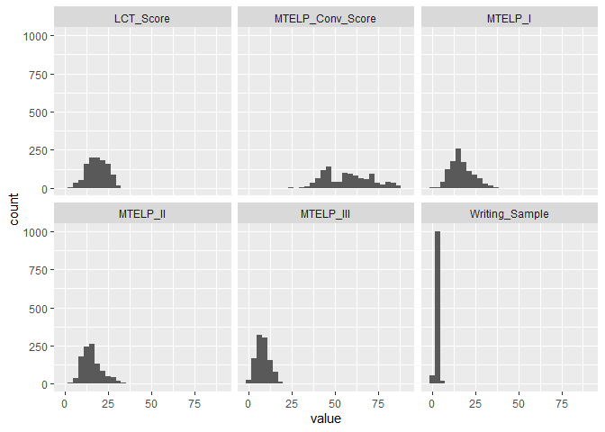
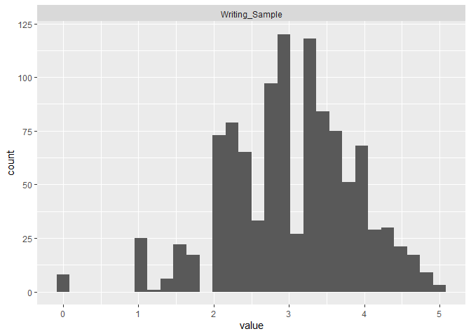
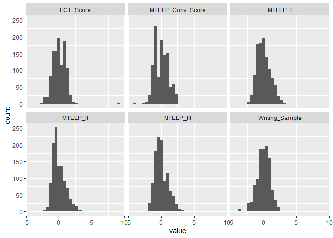
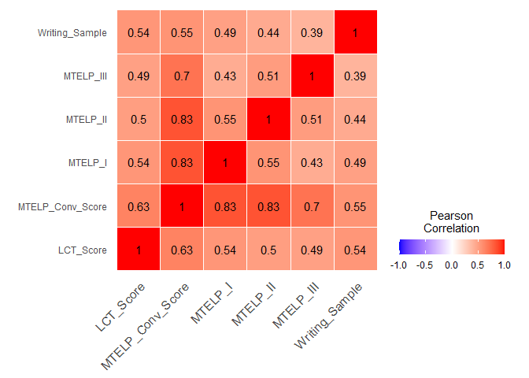

FutureTenseConstructionL2English
================
Daniel Crawford
04/02/2024

- [Pull in final data](#pull-in-final-data)
- [A Proficiency Marker](#a-proficiency-marker)

# Pull in final data

``` r
#Import Packages
library(tidyverse)
```

    ## ── Attaching core tidyverse packages ──────────────────────── tidyverse 2.0.0 ──
    ## ✔ dplyr     1.1.3     ✔ readr     2.1.4
    ## ✔ forcats   1.0.0     ✔ stringr   1.5.0
    ## ✔ ggplot2   3.4.3     ✔ tibble    3.2.1
    ## ✔ lubridate 1.9.2     ✔ tidyr     1.3.0
    ## ✔ purrr     1.0.2     
    ## ── Conflicts ────────────────────────────────────────── tidyverse_conflicts() ──
    ## ✖ dplyr::filter() masks stats::filter()
    ## ✖ dplyr::lag()    masks stats::lag()
    ## ℹ Use the conflicted package (<http://conflicted.r-lib.org/>) to force all conflicts to become errors

``` r
construction_counts = as_tibble(read.csv('FINAL_DATA_countruction_counts_and_student_info_with_scores.csv'))
```

``` r
#Get proportions
construction_props = construction_counts %>% 
  mutate(prop_goingTo_construction = count_goingTo_construction/(count_will_construction+count_goingTo_construction), .after = anon_id) %>% 
  mutate(prop_will_construction = count_will_construction/(count_will_construction+count_goingTo_construction), .after = anon_id)

construction_props
```

    ## # A tibble: 1,078 × 35
    ##        X anon_id prop_will_construction prop_goingTo_construction
    ##    <int> <chr>                    <dbl>                     <dbl>
    ##  1     1 aa0                     1                         0     
    ##  2     2 aa1                     1                         0     
    ##  3     3 aa2                     0.909                     0.0909
    ##  4     4 aa3                     0.75                      0.25  
    ##  5     5 aa5                     1                         0     
    ##  6     6 aa8                     0.0833                    0.917 
    ##  7     7 aa9                     0.571                     0.429 
    ##  8     8 ab2                     1                         0     
    ##  9     9 ab6                     1                         0     
    ## 10    10 ab8                     1                         0     
    ## # ℹ 1,068 more rows
    ## # ℹ 31 more variables: count_will_construction <int>,
    ## #   count_goingTo_construction <int>, gender <chr>, birth_year <int>,
    ## #   native_language <chr>, language_used_at_home <chr>,
    ## #   non_native_language_1 <chr>, yrs_of_study_lang1 <chr>,
    ## #   study_in_classroom_lang1 <chr>, ways_of_study_lang1 <chr>,
    ## #   non_native_language_2 <chr>, yrs_of_study_lang2 <chr>, …

``` r
#Raw Distributuion of Scores

construction_props %>% 
  select(LCT_Score, MTELP_I, MTELP_II, MTELP_III, MTELP_Conv_Score, Writing_Sample) %>% 
  pivot_longer(everything()) %>% 
  ggplot(aes(x = value)) +
  geom_histogram() +
  facet_wrap(~name)
```

    ## `stat_bin()` using `bins = 30`. Pick better value with `binwidth`.

<!-- -->

``` r
construction_props %>% 
  select(Writing_Sample) %>% 
  pivot_longer(everything()) %>% 
  ggplot(aes(x = value)) +
  geom_histogram() +
  facet_wrap(~name)
```

    ## `stat_bin()` using `bins = 30`. Pick better value with `binwidth`.

<!-- -->

``` r
#Correlation of Proficiency Scores:

scaled_construction_props = construction_props %>% 
  select(anon_id, prop_will_construction, prop_goingTo_construction, LCT_Score, MTELP_I, MTELP_II, MTELP_III, MTELP_Conv_Score, Writing_Sample) %>% 
  mutate(across(-c(anon_id,prop_will_construction, prop_goingTo_construction), ~ scale(.x))) 
  
  
scaled_construction_props
```

    ## # A tibble: 1,078 × 9
    ##    anon_id prop_will_construction prop_goingTo_construction LCT_Score[,1]
    ##    <chr>                    <dbl>                     <dbl>         <dbl>
    ##  1 aa0                     1                         0              1.51 
    ##  2 aa1                     1                         0             -1.10 
    ##  3 aa2                     0.909                     0.0909        -0.613
    ##  4 aa3                     0.75                      0.25           1.51 
    ##  5 aa5                     1                         0             -0.940
    ##  6 aa8                     0.0833                    0.917          0.855
    ##  7 aa9                     0.571                     0.429         -2.08 
    ##  8 ab2                     1                         0             -0.613
    ##  9 ab6                     1                         0              0.529
    ## 10 ab8                     1                         0             -0.940
    ## # ℹ 1,068 more rows
    ## # ℹ 5 more variables: MTELP_I <dbl[,1]>, MTELP_II <dbl[,1]>,
    ## #   MTELP_III <dbl[,1]>, MTELP_Conv_Score <dbl[,1]>, Writing_Sample <dbl[,1]>

``` r
scaled_construction_props %>% 
  select(LCT_Score, MTELP_I, MTELP_II, MTELP_III, MTELP_Conv_Score, Writing_Sample) %>% 
  pivot_longer(everything()) %>% 
  ggplot(aes(x = value)) +
  geom_histogram() +
  facet_wrap(~name)
```

    ## `stat_bin()` using `bins = 30`. Pick better value with `binwidth`.

<!-- -->

``` r
cm = cor(scaled_construction_props %>%  select(LCT_Score, MTELP_I, MTELP_II, MTELP_III, MTELP_Conv_Score, Writing_Sample))

as_tibble(cm) %>%
  mutate(score = rownames(cm)) %>%
  pivot_longer(!score) %>%
  mutate(value = round(value,2)) %>% 
  
  ggplot(aes(x = score, y = name, fill = value)) +
  
  geom_tile(color = "white") +
  scale_fill_gradient2(
    low = "blue",
    high = "red",
    mid = "white",
    midpoint = 0,
    limit = c(-1, 1),
    space = "Lab",
    name = "Pearson\nCorrelation"
  ) +
  theme_minimal() + # minimal theme
  theme(axis.text.x = element_text(
    angle = 45,
    vjust = 1,
    size = 12,
    hjust = 1
  )) +
  coord_fixed() +
  geom_text(aes(score, name, label = value),
            color = "black",
            size = 4) +
  theme(
    axis.title.x = element_blank(),
    axis.title.y = element_blank(),
    panel.grid.major = element_blank(),
    panel.border = element_blank(),
    panel.background = element_blank(),
    axis.ticks = element_blank(),
    legend.justification = c(1, 0),
    legend.direction = "horizontal"
  ) +
  guides(fill = guide_colorbar(
    barwidth = 7,
    barheight = 1,
    title.position = "top",
    title.hjust = 0.5
  ))
```

<!-- -->

``` r
rownames(cm)
```

    ## [1] "LCT_Score"        "MTELP_I"          "MTELP_II"         "MTELP_III"       
    ## [5] "MTELP_Conv_Score" "Writing_Sample"

``` r
construction_props %>%
  #Get Only languages with at least 30 L1 speakers
  group_by(native_language) %>% 
  filter(n()>30) %>% 
  select(native_language, prop_will_construction, prop_goingTo_construction) %>% 
  
  summarise(across(everything(), .f = list(mean = mean), na.rm = TRUE)) %>% 
  pivot_longer(cols = starts_with('prop')) %>% 
  
  
  #Plotting
  mutate(name = str_split_i(name, "_",2)) %>% 
  arrange(desc(value)) %>% 
  mutate(Group = factor(native_language, levels = unique(native_language))) %>% 
  ggplot(aes(Group, value, fill = name))+
    geom_bar(stat = 'identity', position = 'dodge')+
    labs(title = "L1 In Future Tense Construction Proportion", x = "Native Language (L1)", y = "Proportion", fill = "Construction") +
    theme_minimal()
```

    ## Warning: There was 1 warning in `summarise()`.
    ## ℹ In argument: `across(everything(), .f = list(mean = mean), na.rm = TRUE)`.
    ## ℹ In group 1: `native_language = "Arabic"`.
    ## Caused by warning:
    ## ! The `...` argument of `across()` is deprecated as of dplyr 1.1.0.
    ## Supply arguments directly to `.fns` through an anonymous function instead.
    ## 
    ##   # Previously
    ##   across(a:b, mean, na.rm = TRUE)
    ## 
    ##   # Now
    ##   across(a:b, \(x) mean(x, na.rm = TRUE))

<!-- -->

# A Proficiency Marker
